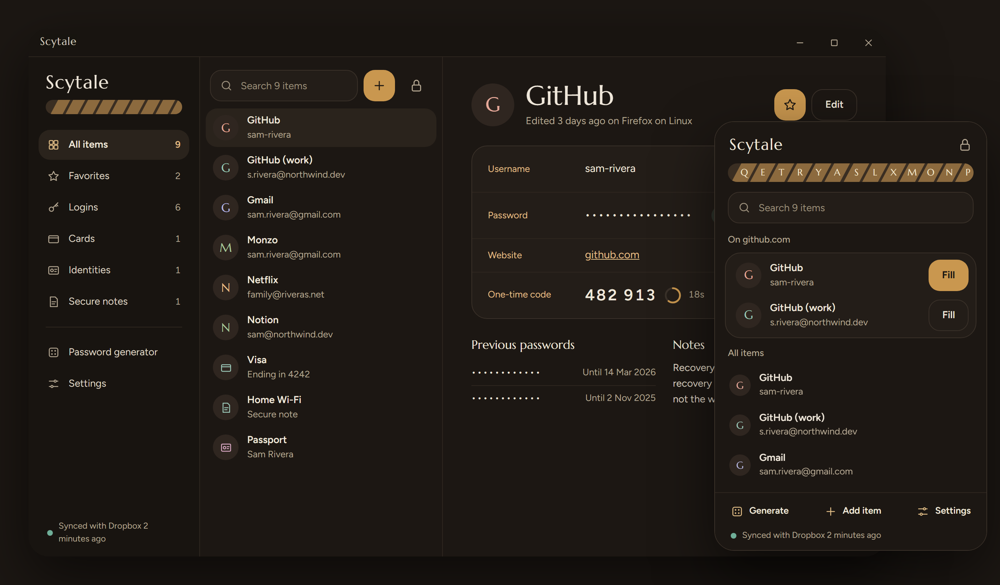
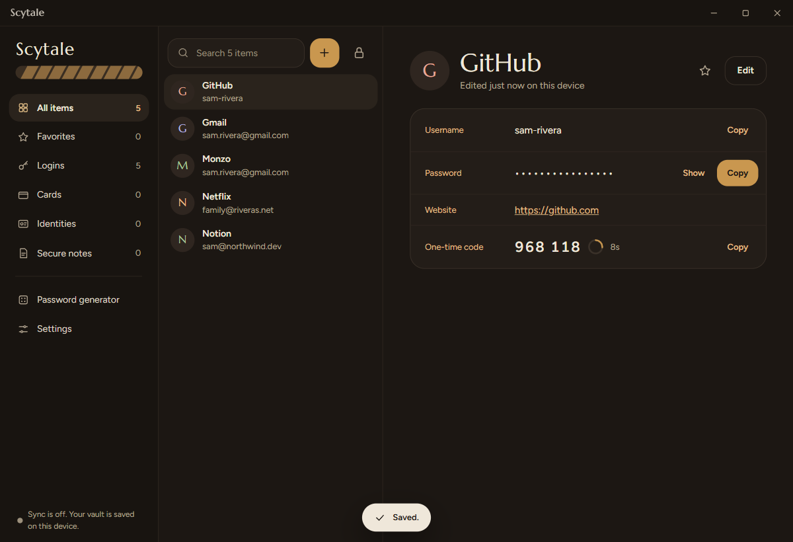
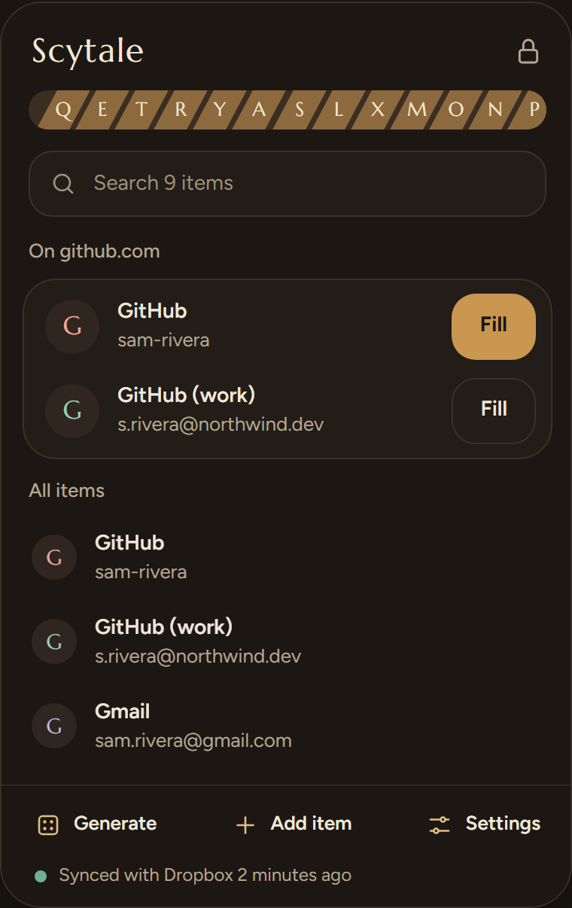
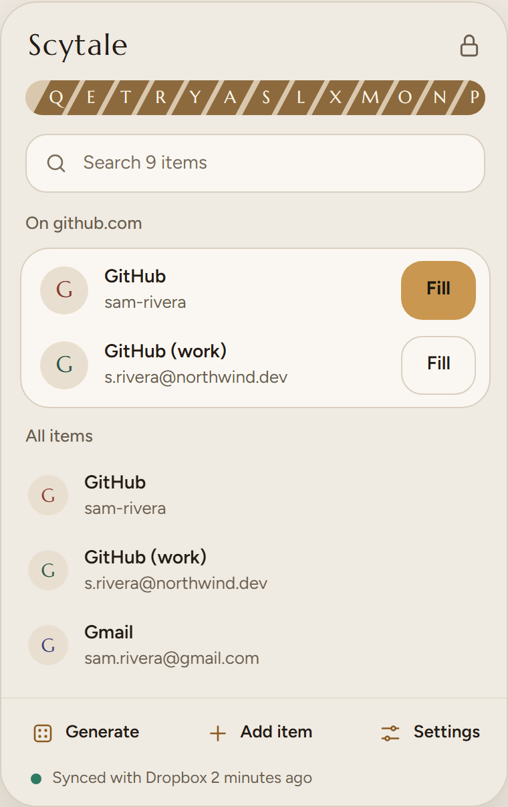
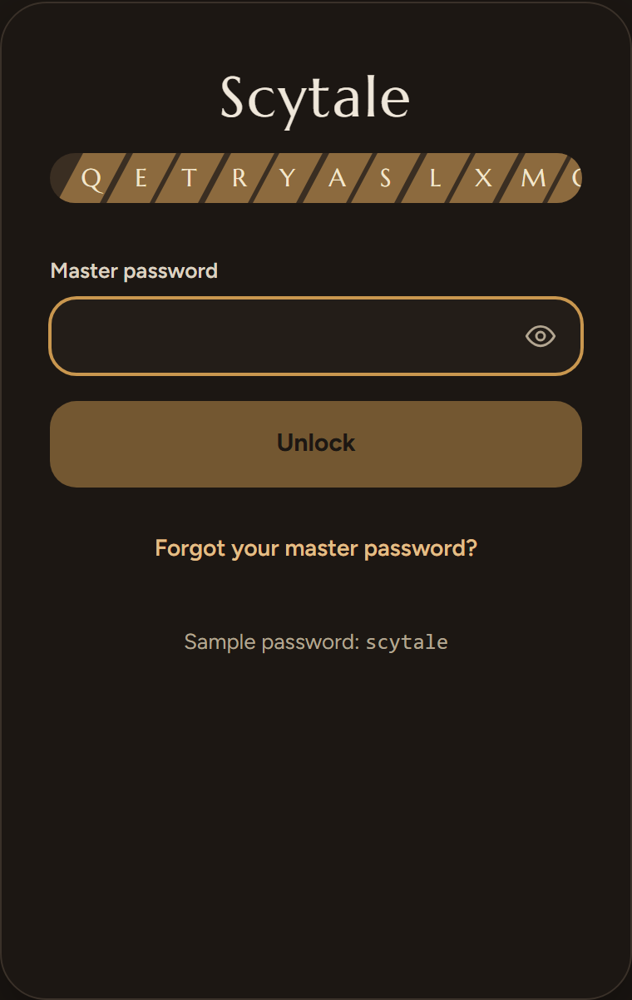
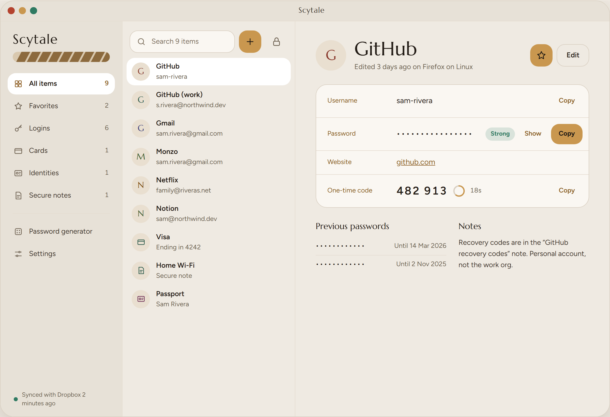
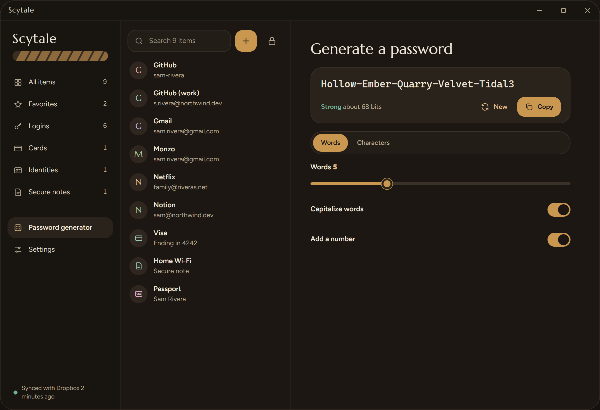
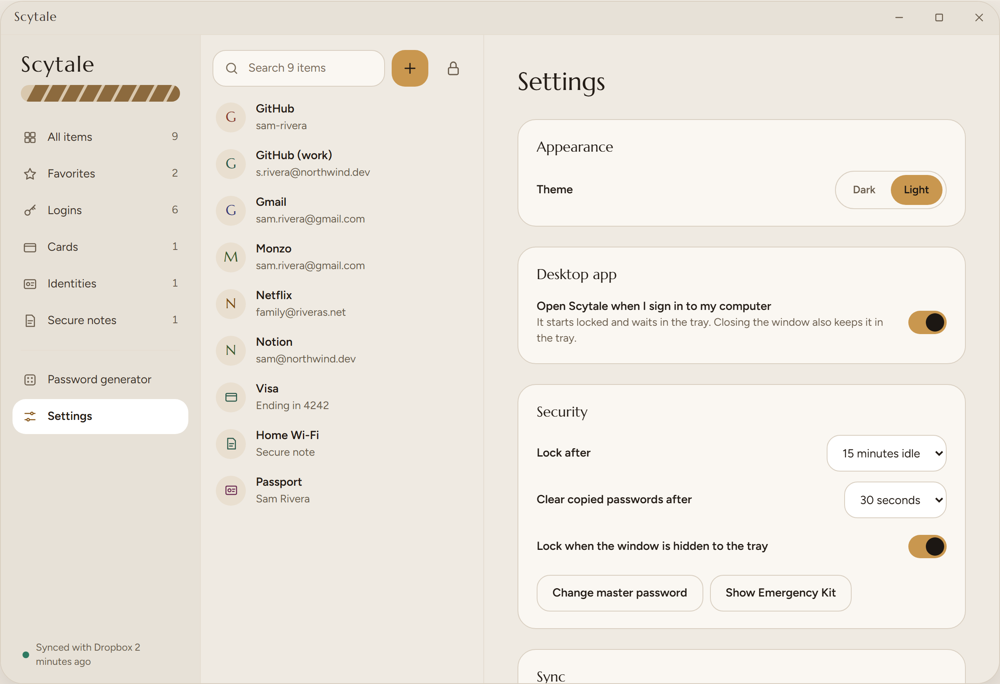
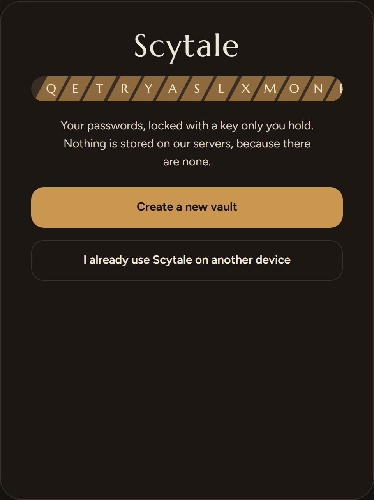
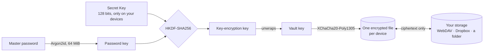

<div align="center">


# Scytale

**A free, open-source password manager with no server.**

Your vault is encrypted on your device and synced through storage you already own.<br>
Nobody else can read it: not us, not your cloud provider.

[](https://github.com/abdvlrqhman/Scytale/actions/workflows/ci.yml)
[](https://github.com/abdvlrqhman/Scytale/releases/latest)
[](LICENSE)


[Install](#install) · [How it works](#how-it-works) · [Security](#security) · [Build from source](#build-from-source)

<br>



</div>

<br>

> *Scytale* (SKIT-uh-lee) was the Spartans' cipher rod. A message wound around it could only be read
> by someone holding a rod of the same thickness. Your vault works the same way: it opens only with
> your master password **and** the Secret Key that lives on your own devices.

## Why Scytale

|  |  |
|---|---|
| **No server, no account** | There is nothing to breach and nothing to pay for. Sync goes through your own Nextcloud, WebDAV server, Dropbox, or any folder Syncthing or iCloud Drive keeps in sync. |
| **Two secrets** | A stolen vault file is useless without the 128-bit Secret Key that never leaves your devices, even if your master password is weak. |
| **One audited core** | All cryptography lives in one small Rust crate, used natively by the desktop app and as WebAssembly by the extension, and checked against an independent implementation in CI. |
| **Built to resist phishing** | Logins are filled only on the site they belong to, never into hidden fields or cross-site frames, and only when you ask. |
| **Free and open** | GPL-3.0. Builds are reproducible, and every release ships with checksums and signed build provenance. |

## Screenshots


<p align="center"><sub>The desktop app on Windows, with its own title bar and a live one-time code</sub></p>

<table>
  <tr>
    <td width="33%"></td>
    <td width="33%"></td>
    <td width="33%"></td>
  </tr>
  <tr>
    <td align="center"><sub>Fill the right login in one click</sub></td>
    <td align="center"><sub>Light theme</sub></td>
    <td align="center"><sub>Unlock</sub></td>
  </tr>
</table>

<table>
  <tr>
    <td width="50%"></td>
    <td width="50%"></td>
  </tr>
  <tr>
    <td align="center"><sub>Desktop app, light theme</sub></td>
    <td align="center"><sub>Passphrases and passwords, uniformly random</sub></td>
  </tr>
  <tr>
    <td width="50%"></td>
    <td width="50%"></td>
  </tr>
  <tr>
    <td align="center"><sub>Settings</sub></td>
    <td align="center"><sub>Two-minute setup</sub></td>
  </tr>
</table>

<sub>Screens show fictional sample data.</sub>

## Install

Get the files from the **[latest release](https://github.com/abdvlrqhman/Scytale/releases/latest)**.

### Brave, Chrome, Edge, Opera, Vivaldi

Until the store listings are live, install the release build directly:

1. Download **`scytale-<version>-chrome.zip`** and unzip it into a folder you will keep.
2. Open the extensions page: `brave://extensions` (Chrome: `chrome://extensions`, Edge:
   `edge://extensions`, Opera: `opera://extensions`, Vivaldi: `vivaldi://extensions`).
3. Turn on **Developer mode**.
4. Click **Load unpacked** and choose the unzipped folder.
5. Pin Scytale: open the puzzle-piece menu and click the pin next to Scytale.

The first click on the icon walks you through creating your vault. Press <kbd>Ctrl</kbd>+<kbd>Shift</kbd>+<kbd>L</kbd>
(<kbd>⌘</kbd>+<kbd>Shift</kbd>+<kbd>L</kbd> on a Mac) on a sign-in page to fill your login.

### Firefox

Firefox installs only signed add-ons permanently, so the Firefox build arrives with its listing on
addons.mozilla.org. To try it now: open `about:debugging`, choose **This Firefox**, then **Load
Temporary Add-on**, and pick **`scytale-<version>-firefox.zip`**. Firefox removes it when it restarts.

### Desktop app

| System | File | First launch |
|---|---|---|
| Windows 10/11 | `Scytale_<version>_x64-setup.exe` (or `.msi`) | The installer is not code-signed yet, so SmartScreen may warn: choose **More info**, then **Run anyway**. |
| macOS | `Scytale_<version>_universal.dmg` | Not yet notarized: right-click the app, choose **Open**, then **Open** again. |
| Linux | `.AppImage`, `.deb` or `.rpm` | AppImage: `chmod +x Scytale*.AppImage` and run it. |

The desktop app has its own window controls and lives in the tray: closing the window keeps it
running, quitting is in the tray menu. **Settings, Desktop app** lets it start when you sign in.
Updates install from inside the app, and each one is checked against the release signing key.

### Check what you downloaded

Every release carries `SHA256SUMS.txt` and signed build provenance:

```sh
sha256sum -c SHA256SUMS.txt --ignore-missing
gh attestation verify Scytale_1.0.0_x64-setup.exe --repo abdvlrqhman/Scytale
```

## How it works



- **Unlocking** derives a key from your master password (Argon2id), mixes in the Secret Key (HKDF),
  and unwraps the vault key. Changing your master password re-wraps that one key; nothing else is
  re-encrypted.
- **Sync** never overwrites another device's data. Each device writes only its own encrypted file and
  reads the others. Edits merge per item by a hybrid logical clock, so devices that were offline
  converge. If two devices change the same password, the losing one is kept in that item's password
  history rather than lost.
- **Files** are padded to hide how many items you have, and every file is bound to its vault, device
  and sequence number, so files cannot be swapped or rolled back.

The full specifications: [cryptography](docs/CRYPTO.md) · [sync](docs/SYNC.md) ·
[file formats](docs/VAULT_FORMAT.md) · [architecture](docs/ARCHITECTURE.md).

## Security

| Who | What they get |
|---|---|
| **Us, the maintainers** | Nothing. There is no Scytale server, and no token or file ever reaches us. |
| **Your storage provider** | Encrypted, padded files. Opening them needs your master password *and* your Secret Key. |
| **A phishing site** | Nothing. Logins fill only on their own site (Public Suffix List rules), never over a downgraded `http` connection, and never into cross-site frames or invisible fields. |
| **A page trying to trick clicks** | No injected autofill UI to hijack: filling happens from the toolbar popup or the keyboard shortcut. |
| **Someone with your powered-off laptop** | An encrypted vault. The Secret Key alone does not open it. |

What Scytale does **not** protect against (malware on your device, a compromised browser, losing your
Secret Key *and* every device) is listed in the [threat model](docs/THREAT_MODEL.md).

Found a vulnerability? Please report it privately; see [SECURITY.md](SECURITY.md).

> [!IMPORTANT]
> Scytale 1.0 has not had an independent security audit yet. The design is documented and the
> cryptography is tested against published vectors and an independent implementation, but an audit
> is the next milestone.

## Sync options

| Storage | Extension | Desktop | Notes |
|---|:-:|:-:|---|
| WebDAV (Nextcloud, ownCloud, Synology…) | Yes | Yes | Use an app password. |
| A synced folder (Syncthing, iCloud Drive, Dropbox or Google Drive apps…) | | Yes | Scytale writes only encrypted files into a `scytale` folder. |
| Dropbox | Yes\* | | \*Needs a Dropbox app key at build time ([how](apps/extension/src/providers.ts)). |
| Google Drive, OneDrive | | | Planned; they need OAuth app reviews first. |

## Build from source

Requirements: [Rust](https://rustup.rs) (the version is pinned in `rust-toolchain.toml`), Node 24+,
pnpm 11 (`npm i -g pnpm@11`), and `wasm-bindgen-cli` at the version pinned in
`crates/core-wasm/Cargo.toml`. The desktop app also needs the
[Tauri prerequisites](https://v2.tauri.app/start/prerequisites/) for your system.

```sh
pnpm install
pnpm run build:wasm                                 # the Rust core, as WebAssembly
pnpm --filter @scytale/extension run build          # -> apps/extension/.output/chrome-mv3
pnpm --filter @scytale/extension run build:firefox  # -> apps/extension/.output/firefox-mv3
pnpm --filter @scytale/desktop run build            # -> target/release/bundle

cargo test --workspace && pnpm run check && pnpm run test
pnpm --filter @scytale/extension run e2e            # the real extension in Chromium
```

The extension build is reproducible: `docker build -f scripts/extension.Dockerfile -o out .`
([details](apps/extension/BUILDING.md)).

<details>
<summary><b>Repository layout</b></summary>

```
crates/core          Rust: crypto, vault format, merge, generator, TOTP, import/export. No I/O.
crates/core-wasm     WebAssembly bindings for the extension
packages/client      TypeScript use cases: unlock, items, sync, import/export
packages/ui          Svelte 5 design system and screens, shared by both apps
apps/extension       Browser extension (WXT): Chromium browsers and Firefox
apps/desktop         Desktop app (Tauri 2): Windows, macOS, Linux
docs/                Architecture, cryptography, sync, file formats, threat model
```

</details>

## Roadmap

- Chrome Web Store, Firefox Add-ons and Microsoft Edge listings
- Google Drive and OneDrive sync
- Passkeys, and an in-page autofill menu built with clickjacking defenses
- Unlock with Windows Hello and Touch ID
- Android and iOS apps with system autofill
- An independent security audit

## Contributing

Issues and pull requests are welcome; start with [CONTRIBUTING.md](CONTRIBUTING.md). Changes to the
cryptography need a spec update and test vectors in the same pull request.

## License

[GPL-3.0-or-later](LICENSE). Forks of a security tool should stay open source, so anyone can check them.
